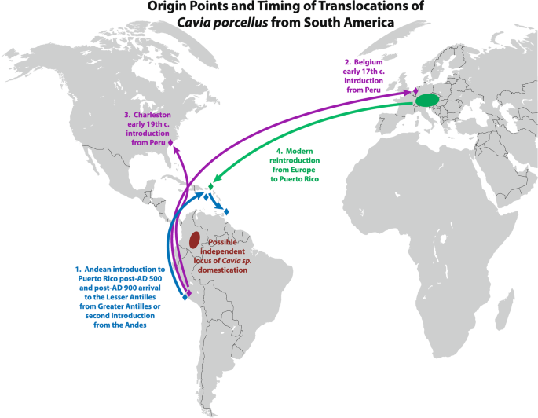
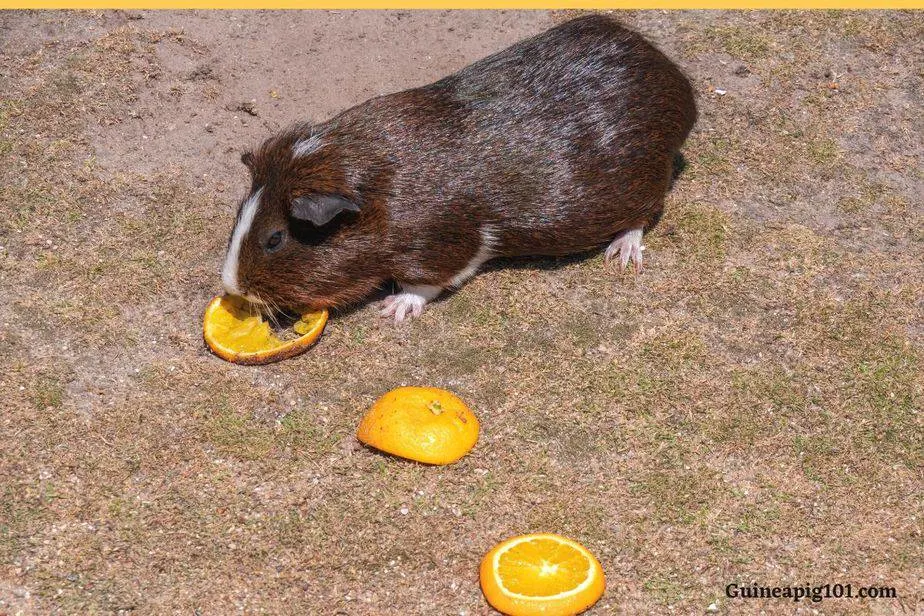

```{r setup, include=FALSE}
#Include following if you want to force hide all code
#in the output
#knitr::opts_chunk$set(echo = TRUE)

#Load necessary packages
library(tidyverse)
library(knitr)
library(leaflet)
library(hexbin)
```

[The following data is coming from 'ToothGrowth', a built in dataset in R looking at the tooth growth of guinea pigs in response to Vitamin C.]{style="color:black"}

[Here are a few plots showing the tooth growth in Guinea Pigs that received varying doses of Vitamin C from either Orange Juice or Ascorbic acid.]{style="color:purple"}
```{r Toothgrowth plot, warning=FALSE}
ggplot(ToothGrowth, aes(dose, len, colour = supp)) +
  geom_point() +
  labs(colour = "Supplement type", title = "Tooth Growth of Guinea Pigs", y =
         "Tooth Length (mm?)", x = 
         "Vitamin C dose in mg/day")


```


```{r Toothgrowth plot with conditional means, message=FALSE, warning=FALSE}

ggplot(ToothGrowth, aes(dose, len, colour = supp)) +
  geom_point() +
  geom_smooth() +
  labs(fill = "Supplement type", title = "Tooth Growth of Guinea Pigs", y =
         "Tooth Length (mm?)", x = 
         "Vitamin C dose in mg/day")

```


[Here's a really ugly graph.]{style="color:red"}
```{r Toothgrowth Polygon Plot, warning=FALSE}
ggplot(ToothGrowth, aes(dose, len, fill = supp)) +
  geom_polygon()

```


[Now we can look at some models of our Tooth growth data.]{style="color:black"}
```{r Toothgrowth linear model 1, warning=FALSE}
model_2 <- lm(len ~ supp, data = ToothGrowth)
anova(model_2)


```


```{r Toothgrowth linear model 2, warning=FALSE}
model_1 <- lm(len ~ dose, data = ToothGrowth)
anova(model_1)


```


Guinea Pig tooth lengths range from `r min(ToothGrowth$len)` to `r max(ToothGrowth$len)`


[Here's a table showing some of the raw data.]{style="color:green"}
```{r Toothgrowth table}
kable(ToothGrowth[1:60, ], caption = 'Table 1. Data on 60 Guinea Pigs and their associated tooth growth in response to Vitamin C.')

```


```{r Toothgrowth, warning=FALSE}

summary1 <- summarise(group_by(ToothGrowth, dose),
                      n = n(),
                      mean = mean(len),
                      sd = sd(len))
kable(summary1, caption = 'Table 2. A summary kable displaying number, mean, and standard deviation of tooth length for each dosage of Vitamin C.')

```








[Central location of native range of *Cavia porcellus's* wild ancestor: *Cavia tschudii*.]{style="color:green"}

```{r Cavia tschudii map, warning=FALSE}
leaflet() %>%
  setView(-75.906574, -8.609524, zoom = 3) %>%
  addTiles() %>%
  addMarkers(-75.906574, -8.609524, popup = "Andes Mtns")

```


[Guinea Pig eating Orange ASMR]{style="color:black"}

<iframe width ="610" height="348"
src= "https://www.youtube.com/watch?v=Kn9EuZPj5EI&ab_channel=AnimalASMR" data-external="1">

</iframe>

https://www.youtube.com/watch?v=Kn9EuZPj5EI&ab_channel=AnimalASMR

